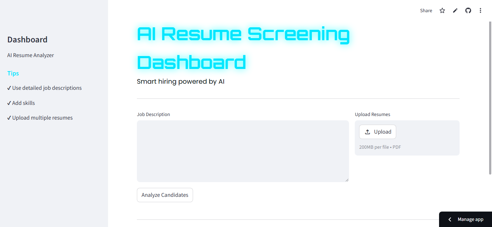
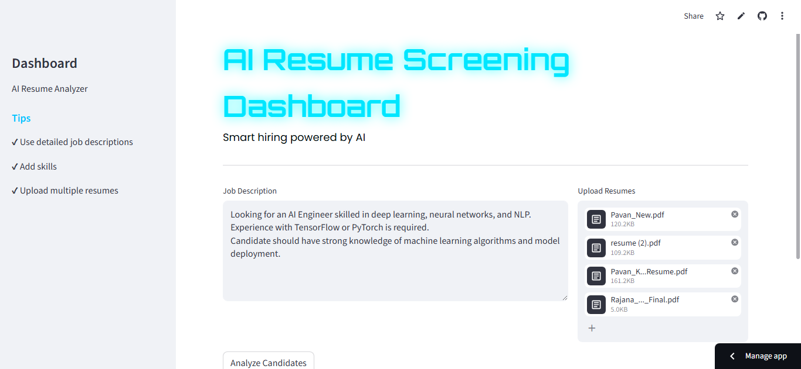
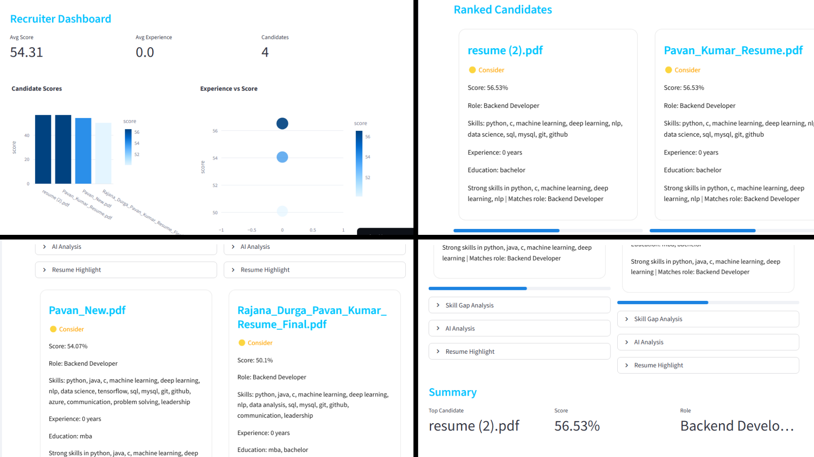

# 🤖 AI Resume Screening & Job Match System

> A production-ready, AI-powered ATS dashboard built with **Streamlit** and **FastAPI**.  
> Upload resumes, paste a job description, and instantly rank candidates by match score.

---

## ✨ Features

| Feature | Description |
|---|---|
| 📄 PDF Parsing | Extract clean text from any PDF resume |
| 🧠 Skill Extraction | Weighted skill matching against a curated skills database |
| 📊 Similarity Scoring | TF-IDF cosine similarity between JD and resume |
| 🎓 Education Detection | Detect degrees and institutions automatically |
| 💼 Experience Extraction | Parse years of experience from resume text |
| 🏷️ Role Prediction | ML classifier maps each resume to likely job roles |
| 🤖 GPT Analysis | Optional OpenAI-powered narrative analysis per candidate |
| 📈 Recruiter Dashboard | KPI metrics, bar & scatter charts, ranked candidate cards |
| 🔍 Skill Gap Analysis | Highlights skills in the JD missing from the resume |
| 🎤 Interview Questions | Auto-generated, role-specific interview question sets |
| 📥 CSV Export | Download the full shortlist as a spreadsheet |
| ⚡ FastAPI Backend | REST API for programmatic access to the pipeline |

---

## 🗂️ Project Structure

```
AI-Resume-Job-Match-System/
│
├── app.py                  # Streamlit frontend entry point
├── config.py               # All constants and path configuration
├── requirements.txt        # Python dependencies
├── README.md
├── LICENSE
├── .gitignore
│
├── api/
│   └── main.py             # FastAPI REST API
│
├── src/
│   ├── __init__.py
│   ├── preprocess.py       # Text cleaning & normalisation
│   ├── pdf_parser.py       # PDF → plain text extraction
│   ├── skill_extractor.py  # Skill detection & weighting
│   ├── similarity.py       # TF-IDF / SBERT cosine similarity
│   ├── job_predictor.py    # ML role classifier
│   ├── experience_extractor.py
│   ├── education_parser.py
│   ├── explainer.py        # SHAP / LIME explainability
│   ├── explainer_llm.py    # LLM-based explanation
│   ├── gpt_analyzer.py     # OpenAI GPT resume analysis
│   ├── highlighter.py      # Keyword highlighting
│   ├── pipeline.py         # End-to-end pipeline orchestrator
│   └── train.py            # Model training & vectorizer
│
├── data/
│   ├── skills.txt          # One skill per line
│   └── job_roles.csv       # Training data: text, label
│
├── utils/
│   └── helpers.py          # Shared utility functions
│
├── assets/
│   ├── styles.css          # External stylesheet (glassmorphism)
│   └── screenshots/
│       ├── home.png
│       ├── upload.png
│       └── result.png
│
├── notebooks/
│   └── exploration.ipynb   # EDA and model prototyping
│
└── .devcontainer/
    └── devcontainer.json   # VS Code Dev Container config
```

---

## 🚀 Quick Start

### 1. Clone the repository

```bash
git clone https://github.com/your-username/AI-Resume-Job-Match-System.git
cd AI-Resume-Job-Match-System
```

### 2. Create and activate a virtual environment

```bash
python -m venv venv
# Linux / macOS
source venv/bin/activate
# Windows
venv\Scripts\activate
```

### 3. Install dependencies

```bash
pip install -r requirements.txt
python -m spacy download en_core_web_sm
```

### 4. Set environment variables

Create a `.env` file in the project root:

```env
OPENAI_API_KEY=sk-...          # optional — GPT analysis only
API_HOST=0.0.0.0
API_PORT=8000
LOG_LEVEL=INFO
```

### 5. Run the Streamlit app

```bash
streamlit run app.py
```

### 6. Run the FastAPI backend (optional)

```bash
uvicorn api.main:app --reload --host 0.0.0.0 --port 8000
```

API docs available at `http://localhost:8000/docs`

### 7. Deploy FastAPI Backend to Vercel (Serverless)

The FastAPI REST API backend is pre-configured for Vercel Serverless Functions:
1. Connect your repository to the **Vercel Dashboard** or install the **Vercel CLI** (`npm i -g vercel`).
2. Run `vercel` in the project root to deploy, or let Vercel trigger deployments on git pushes automatically.
3. Configure environment variables (like `OPENAI_API_KEY`) in the Vercel project settings if you are using the AI Analysis feature.

---

## 📊 Scoring Formula

```
Final Score = 0.50 × Similarity Score
            + 0.30 × Skill Match Score
            + 0.20 × Normalised Experience Score
```

| Score Range | Decision |
|---|---|
| ≥ 75% | 🟢 **Hire** |
| 50–74% | 🟡 **Consider** |
| < 50% | 🔴 **Reject** |

---

## 🗃️ Data Files

### `data/skills.txt`
One skill per line, optionally followed by a weight separated by a comma:

```
python,3
machine learning,5
sql,2
docker
kubernetes,4
```

### `data/job_roles.csv`
Training data for the role classifier:

```csv
text,label
"experience with python scikit-learn pandas...",Data Scientist
"built rest apis using fastapi postgresql...",Backend Engineer
```

---

## 🔌 REST API Endpoints

| Method | Endpoint | Description |
|---|---|---|
| `GET` | `/` | Health check |
| `POST` | `/analyze` | Analyse a single resume against a JD |
| `POST` | `/batch` | Analyse multiple resumes, returns ranked list |
| `GET` | `/skills` | List all skills in the database |

---

## 🧪 Running Tests

```bash
pytest tests/ -v
```

---

## 🖥️ Screenshots

| Home | Upload | Results |
|---|---|---|
|  |  |  |

---

## 🛠️ Tech Stack

- **Frontend** — Streamlit, Plotly, custom CSS (Glassmorphism)
- **Backend** — FastAPI, Uvicorn
- **NLP** — scikit-learn TF-IDF, spaCy, sentence-transformers
- **LLM** — OpenAI GPT-3.5-turbo
- **PDF** — pdfplumber, PyMuPDF
- **Explainability** — SHAP, LIME

---

## 📄 License

MIT License — see [LICENSE](LICENSE) for details.

---

## 🤝 Contributing

1. Fork the repository  
2. Create a feature branch (`git checkout -b feature/your-feature`)  
3. Commit your changes (`git commit -m 'Add your feature'`)  
4. Push to the branch (`git push origin feature/your-feature`)  
5. Open a Pull Request  

---

<p align="center">Built with ❤️ using Streamlit & FastAPI</p>